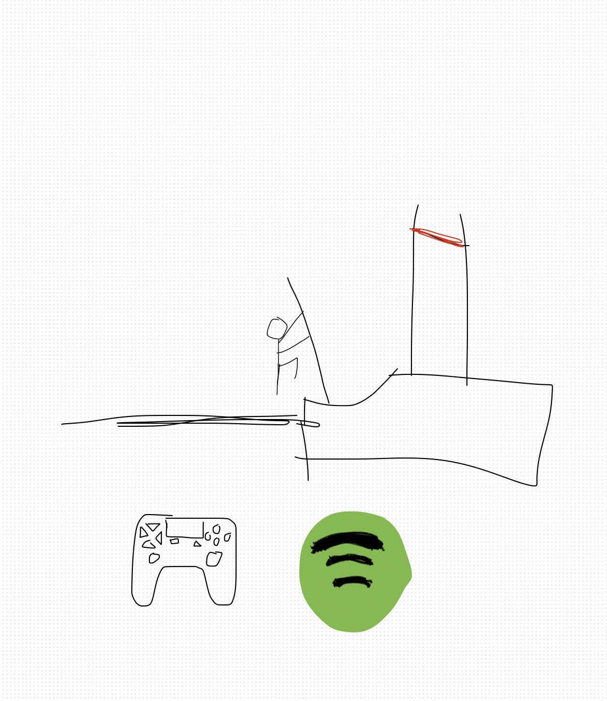

## Peyton Leigh's Home Page
Welcome to my page.

## About Me
Hi! My name is Peyton and I am a 16 year old junior. Some activities I enjoy are going to the beach, pole vaulting, listening to music, and spending time with my friends and family. I enrolled in the Computer Science Principles course to expand my knowledge on the subject and explore new oppotunities.

## Freeform Image
My picture includes a man pole vaulting, my primary sport in high school, a PlayStation controller (my first gaming console), and the Spotify logo because I spend much of my time listening to music.

